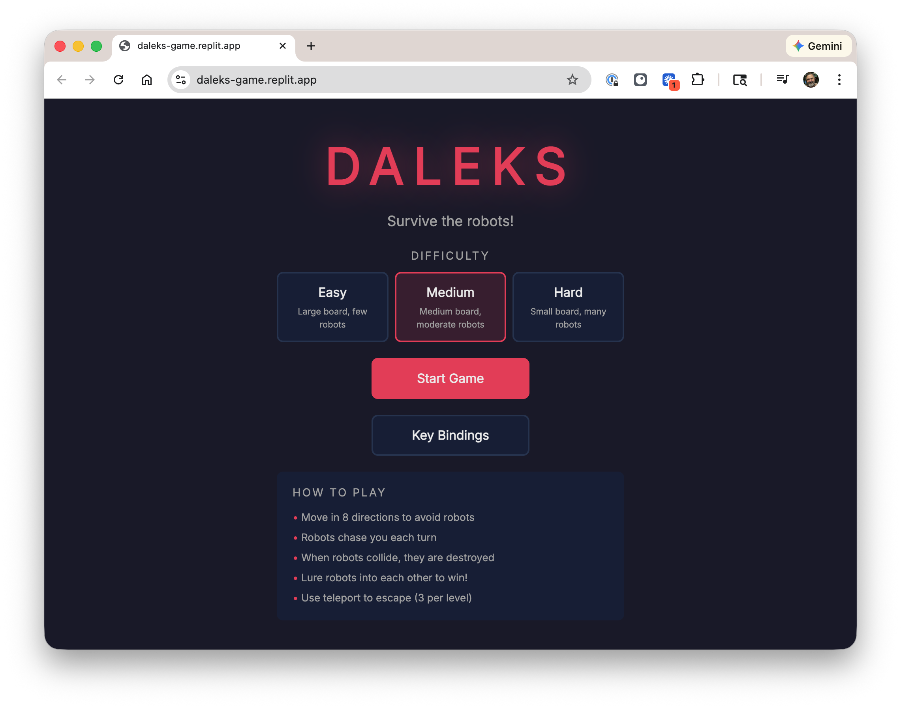

# Daleks

Daleks is a browser-based [chase game] -- a turn-based strategy game where you
must outsmart hostile robots by luring them into collisions with each other.
This particular one is modeled after the classic [Daleks game] on Mac OS, see
this [demo video].

Owner: Sef Kloninger ([email](mailto:sefklon@gmail.com), [personal website]).

This was coded entirely on [Replit]. The only part that is my work is
the first section of this README and the TODO file. It is hosted at 
https://sef.kloninger.com/daleks.

This is the week one exercise for [Vibe Coding: Building Software in
Conversation with AI][t42], Stanford Continuing Studies Winter 2026. Some notes
and screenshots taken during construction are [here][notes]. Going from nothing
to a working, published prototype took about two hours and ten dollars.

[Chase game]: https://en.wikipedia.org/wiki/Chase_(video_game)
[Daleks game]: https://www.macintoshrepository.org/3230-classic-daleks
[demo video]: https://www.youtube.com/watch?v=BUClNr-0c0o
[email]: mailto:sefklon@gmail.com
[personal website]: https://sef.kloninger.com/
[Replit]: https://replit.com
[t42]: https://continuingstudies.stanford.edu/courses/professional-and-personal-development/vibe-coding-building-software-in-conversation-with-ai/20252_TECH-42
[notes]: https://docs.google.com/document/d/1vH1T6AsQGkFoSTNeTPfJikA9Kx4L4hfyN-cpjcS-bQs/edit?tab=t.0

## Gameplay

- You are placed on a 2D grid surrounded by robots (Daleks)
- Each turn, you move one step in any of 8 directions (or stay in place)
- After you move, every robot takes one step toward you
- When two robots collide, they are destroyed and leave behind a scrap pile
- Robots that walk into scrap piles are also destroyed
- Clear all robots to advance to the next level
- You have 3 teleports per level to escape tight situations — but you can't control where you land
- If a robot reaches your position, it's game over

## Features

- Three difficulty levels (Easy, Medium, Hard) with different board sizes and robot counts
- Customizable keyboard bindings saved between sessions
- Smooth movement animations for player and robots
- Teleportation effect with expanding/collapsing circle animations
- Custom SVG sprites: running stick figure player, Dalek-inspired robots, scrap pile debris

### Replit's Restatement of the Prompt

> Build a browser-based recreation of the classic Mac game "Daleks". It's a 2D grid-based, turn-based strategy game where the player must survive hostile robots by maneuvering them into collisions with each other.

### Implementation Plan

The agent broke the project into these steps:

1. **Game state and logic** — Zustand store managing player position, robot AI (chase the player by shortest path), collision detection (robot-robot collisions create piles, robots hitting piles die), level progression
2. **Grid rendering** — React component rendering a 2D cell grid with directional arrows showing available moves
3. **Main menu and difficulty selection** — Title screen with Easy/Medium/Hard options affecting board size and robot count
4. **Status bar** — Displays current level, move count, robots remaining, teleports left
5. **Settings screen** — Configurable key bindings with localStorage persistence

### Refinement Steps

After the initial implementation, the game was refined through a series of conversational requests:

1. **"Add a way for the player to stay in place"** — Added a "stay" action so the player can skip their turn while robots advance, useful for luring robots into each other
2. **"Replace emojis with custom sprites"** — Created SVG components for a running stick figure (player), Dalek-style robot with dome/eye stalk/bumpy base, and scrap pile debris
3. **"Fix bug: check for player death before robot collisions"** — Fixed the collision logic so that if a robot moves onto the player's square, the player dies even if that robot would also collide with another robot
4. **"Add animations"** — Restructured rendering to use absolutely positioned entities with CSS transitions for smooth movement; added teleport effect with expanding circles at the departure point and collapsing circles at the arrival
5. **"Don't draw arrows over piles"** — Fixed directional arrows to not appear on cells occupied by scrap piles

## Tech Stack

- **Frontend**: React + TypeScript
- **State Management**: Zustand
- **Styling**: Custom CSS
- **Server**: Express (serving the Vite-built frontend)
- **No database**: Pure client-side game

## Controls (defaults)

| Action    | Key |
|-----------|-----|
| North     | W   |
| South     | X   |
| East      | D   |
| West      | A   |
| NE        | E   |
| NW        | Q   |
| SE        | C   |
| SW        | Z   |
| Stay      | S   |
| Teleport  | T   |

All key bindings can be customized in the Settings screen.

